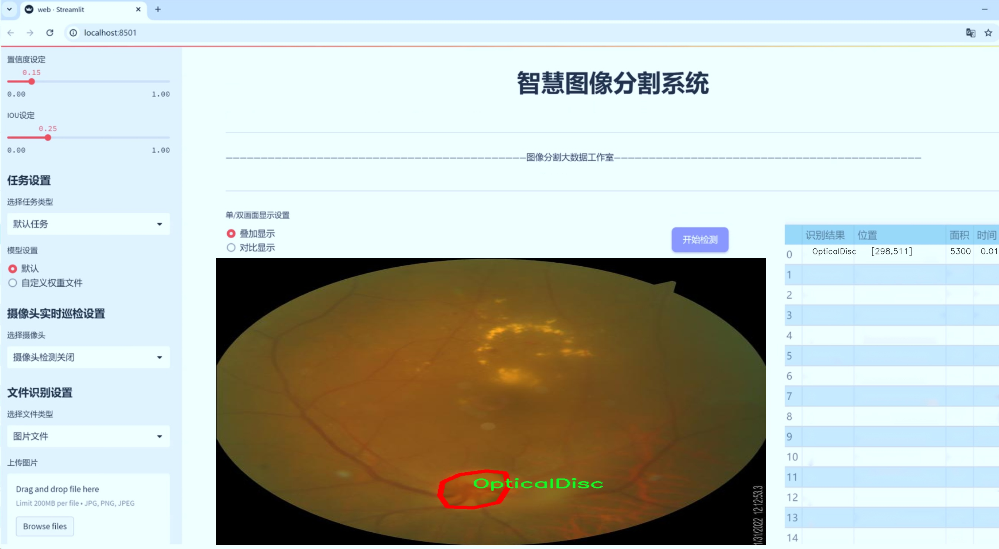

# 青光眼影像分割系统源码＆数据集分享
 [yolov8-seg＆yolov8-seg-C2f-Faster等50+全套改进创新点发刊_一键训练教程_Web前端展示]

### 1.研究背景与意义

项目参考[ILSVRC ImageNet Large Scale Visual Recognition Challenge](https://gitee.com/YOLOv8_YOLOv11_Segmentation_Studio/projects)

项目来源[AAAI Global Al lnnovation Contest](https://kdocs.cn/l/cszuIiCKVNis)

研究背景与意义

青光眼是一种以视神经损伤为特征的眼科疾病，通常伴随视野缺损，严重时可导致失明。根据世界卫生组织的统计，青光眼是全球第二大致盲原因，影响着数百万人的生活质量。早期诊断和干预对于青光眼的管理至关重要，而影像学检查，尤其是视网膜影像的分析，已成为青光眼诊断的重要手段。随着人工智能技术的迅猛发展，基于深度学习的图像处理方法在医学影像分析中展现出巨大的潜力，尤其是在疾病的自动检测和分割任务中。

在众多深度学习模型中，YOLO（You Only Look Once）系列因其快速且高效的目标检测能力而备受关注。YOLOv8作为该系列的最新版本，结合了更先进的网络结构和算法优化，能够在保证检测精度的同时显著提高处理速度。然而，针对青光眼影像的特定需求，YOLOv8的标准模型可能并不足以满足高精度分割的要求。因此，基于改进YOLOv8的青光眼影像分割系统的研究显得尤为重要。

本研究将利用“Segmentation-Sardjito”数据集，该数据集包含1000幅影像，涵盖了青光眼诊断、视神经杯（Optical Cup）和视神经盘（Optical Disc）三个类别。这些类别的细致划分为青光眼的影像分析提供了丰富的信息，尤其是在识别和分割视神经杯与视神经盘的边界时，能够有效帮助临床医生进行更为准确的诊断和评估。通过对这些影像的深度学习处理，我们希望能够提高青光眼的早期诊断率，降低因延误治疗而导致的视力损失风险。

此外，改进YOLOv8模型的引入，不仅能够提升分割精度，还能通过实时处理能力，支持临床工作中的快速决策。这一系统的实现将为眼科医生提供一种新的辅助工具，帮助他们在繁忙的临床环境中更高效地分析影像数据，从而提高青光眼的诊断效率和准确性。

本研究的意义还在于推动医学影像分析领域的技术进步。通过对YOLOv8的改进和优化，我们不仅可以为青光眼影像分割提供新的解决方案，还可以为其他医学影像的分析任务提供借鉴。这将促进人工智能在医疗领域的广泛应用，推动智能医疗的发展，最终实现提高患者生活质量的目标。

综上所述，基于改进YOLOv8的青光眼影像分割系统的研究，不仅具有重要的临床应用价值，还有助于推动相关技术的发展，为未来的医学影像分析提供新的思路和方法。通过本研究，我们期望能够为青光眼的早期诊断和治疗提供更为有效的技术支持，进而降低青光眼导致的失明风险，改善患者的生活质量。

### 2.图片演示




##### 注意：由于此博客编辑较早，上面“2.图片演示”和“3.视频演示”展示的系统图片或者视频可能为老版本，新版本在老版本的基础上升级如下：（实际效果以升级的新版本为准）

  （1）适配了YOLOV8的“目标检测”模型和“实例分割”模型，通过加载相应的权重（.pt）文件即可自适应加载模型。

  （2）支持“图片识别”、“视频识别”、“摄像头实时识别”三种识别模式。

  （3）支持“图片识别”、“视频识别”、“摄像头实时识别”三种识别结果保存导出，解决手动导出（容易卡顿出现爆内存）存在的问题，识别完自动保存结果并导出到tempDir中。

  （4）支持Web前端系统中的标题、背景图等自定义修改，后面提供修改教程。

  另外本项目提供训练的数据集和训练教程,暂不提供权重文件（best.pt）,需要您按照教程进行训练后实现图片演示和Web前端界面演示的效果。

### 3.视频演示

[3.1 视频演示](https://www.bilibili.com/video/BV1Mz15YkEDZ/)

### 4.数据集信息展示

##### 4.1 本项目数据集详细数据（类别数＆类别名）

nc: 2
names: ['OpticalCup', 'OpticalDisc']


##### 4.2 本项目数据集信息介绍

数据集信息展示

在本研究中，我们采用了名为“Segmentation-Sardjito”的数据集，以支持改进YOLOv8-seg的青光眼影像分割系统的训练与验证。该数据集专注于眼科影像的分割任务，特别是青光眼相关的关键结构——视神经盘（Optical Disc）和视杯（Optical Cup）。通过精确分割这些结构，我们能够更好地分析青光眼的特征，从而为临床诊断提供更为有效的支持。

“Segmentation-Sardjito”数据集包含了两类主要的目标，即“OpticalCup”和“OpticalDisc”。这两类的选择是基于青光眼的病理特征，视杯与视神经盘的比率（Cup-to-Disc Ratio, CDR）是评估青光眼的重要指标。视神经盘是眼底图像中可见的视神经的区域，而视杯则是视神经盘内部的凹陷部分。青光眼患者通常会表现出视杯的扩大，因此准确分割这两个区域对于疾病的早期检测和治疗方案的制定至关重要。

该数据集的构建经过了严格的标准化流程，确保每一幅图像的质量和标注的准确性。图像数据来源于多位患者的眼底检查，涵盖了不同阶段的青光眼病例，保证了数据的多样性和代表性。这种多样性不仅提高了模型的泛化能力，也为不同类型的青光眼提供了充分的样本支持。每幅图像都经过专业眼科医生的标注，确保了视杯和视神经盘的边界清晰且准确，从而为后续的深度学习模型训练提供了高质量的标签数据。

在数据集的使用过程中，我们将采用数据增强技术，以进一步提升模型的鲁棒性和适应性。通过旋转、翻转、缩放等操作，我们能够生成多样化的训练样本，从而减少模型对特定图像特征的依赖，增强其在真实场景中的表现。此外，数据集还将被划分为训练集、验证集和测试集，以便于对模型性能的全面评估。

在训练过程中，我们将重点关注模型在分割任务中的表现，尤其是对视杯和视神经盘的分割精度。我们将采用交叉熵损失函数和IoU（Intersection over Union）指标来评估模型的分割效果，确保模型不仅能够准确识别目标区域，还能在边界处保持高精度。通过不断迭代和优化，我们期望在青光眼影像分割领域取得显著的进展，为临床实践提供有力的技术支持。

总之，“Segmentation-Sardjito”数据集为本研究提供了坚实的基础，通过对视杯和视神经盘的精准分割，我们希望能够提升青光眼的早期诊断能力，为患者的治疗和管理提供更为科学的依据。随着研究的深入，我们期待这一数据集能够在青光眼影像分析领域发挥更大的作用，推动相关技术的进步与应用。


### 5.全套项目环境部署视频教程（零基础手把手教学）

[5.1 环境部署教程链接（零基础手把手教学）](https://www.bilibili.com/video/BV1jG4Ve4E9t/?vd_source=bc9aec86d164b67a7004b996143742dc)


[5.2 安装Python虚拟环境创建和依赖库安装视频教程链接（零基础手把手教学）](https://www.bilibili.com/video/BV1nA4VeYEze/?vd_source=bc9aec86d164b67a7004b996143742dc)

### 6.手把手YOLOV8-seg训练视频教程（零基础小白有手就能学会）

[6.1 手把手YOLOV8-seg训练视频教程（零基础小白有手就能学会）](https://www.bilibili.com/video/BV1cA4VeYETe/?vd_source=bc9aec86d164b67a7004b996143742dc)


按照上面的训练视频教程链接加载项目提供的数据集，运行train.py即可开始训练



     Epoch   gpu_mem       box       obj       cls    labels  img_size
     1/200     0G   0.01576   0.01955  0.007536        22      1280: 100%|██████████| 849/849 [14:42<00:00,  1.04s/it]
               Class     Images     Labels          P          R     mAP@.5 mAP@.5:.95: 100%|██████████| 213/213 [01:14<00:00,  2.87it/s]
                 all       3395      17314      0.994      0.957      0.0957      0.0843

     Epoch   gpu_mem       box       obj       cls    labels  img_size
     2/200     0G   0.01578   0.01923  0.007006        22      1280: 100%|██████████| 849/849 [14:44<00:00,  1.04s/it]
               Class     Images     Labels          P          R     mAP@.5 mAP@.5:.95: 100%|██████████| 213/213 [01:12<00:00,  2.95it/s]
                 all       3395      17314      0.996      0.956      0.0957      0.0845

     Epoch   gpu_mem       box       obj       cls    labels  img_size
     3/200     0G   0.01561    0.0191  0.006895        27      1280: 100%|██████████| 849/849 [10:56<00:00,  1.29it/s]
               Class     Images     Labels          P          R     mAP@.5 mAP@.5:.95: 100%|███████   | 187/213 [00:52<00:00,  4.04it/s]
                 all       3395      17314      0.996      0.957      0.0957      0.0845


### 7.50+种全套YOLOV8-seg创新点代码加载调参视频教程（一键加载写好的改进模型的配置文件）

[7.1 50+种全套YOLOV8-seg创新点代码加载调参视频教程（一键加载写好的改进模型的配置文件）](https://www.bilibili.com/video/BV1Hw4VePEXv/?vd_source=bc9aec86d164b67a7004b996143742dc)

### 8.YOLOV8-seg图像分割算法原理

原始YOLOv8-seg算法原理

YOLOv8-seg算法是YOLO系列目标检测模型的最新迭代，旨在实现高效的目标检测与分割。该算法在YOLOv5的基础上进行了多项优化和升级，特别是在网络结构和特征提取方面，展现出更强的性能和灵活性。YOLOv8-seg的设计理念围绕着轻量化、速度与精度的平衡，尤其适用于复杂环境下的小目标检测与分割任务。

YOLOv8-seg的网络结构主要由三个核心部分组成：骨干特征提取网络、特征融合层和检测头层。骨干网络负责从输入图像中提取丰富的特征信息，而特征融合层则将不同尺度的特征进行有效整合，最终通过检测头层输出目标的类别和位置。与传统的YOLO模型相比，YOLOv8-seg在骨干特征提取网络中采用了更为轻量化的C2F模块，取代了原有的C3模块。这一变化不仅减少了计算量，还提高了特征提取的效率。C2F模块通过将卷积操作简化为3×3的卷积核，结合深度可分离卷积的思想，使得模型在保持高效性的同时，能够更好地捕捉图像中的细节特征。

在特征融合层，YOLOv8-seg引入了特征金字塔网络（FPN）和路径聚合网络（PAN），通过双向特征连接和加权融合，提升了对不同尺度特征的提取能力。特别是BiFPN网络的加入，使得YOLOv8-seg在处理多尺度目标时表现得更加出色。BiFPN的设计理念是通过高效的双向跨尺度连接，增强特征之间的交互，确保在不同层次的特征信息能够被充分利用，从而提升检测精度。

YOLOv8-seg在检测头层采用了轻量化的解耦头结构，这一结构的核心在于将目标分类与位置回归过程进行解耦，允许模型在分类和回归任务中独立优化。与传统的锚框方法不同，YOLOv8-seg采用了无锚目标检测策略，进一步提升了检测的灵活性和精度。通过引入Task-Aligned Assigner方法，YOLOv8-seg能够更有效地匹配正负样本，从而优化分类和回归的损失计算。具体而言，分类损失采用了二元交叉熵（BCE）计算，而回归损失则结合了分布焦点损失（DFL）和完全交并比（CIoU）损失，确保模型在训练过程中能够快速收敛并提高泛化能力。

此外，YOLOv8-seg还针对小目标检测进行了特别优化。小目标在复杂背景下往往容易被忽视，因此，YOLOv8-seg在网络结构中引入了更小的检测头，以增强对小目标的感知能力。同时，在Neck端应用了GSConv和Slim-neck技术，进一步降低了计算量的同时保持了模型的精度。这些改进使得YOLOv8-seg在复杂水面环境等挑战性场景下，能够有效应对小目标漂浮物的检测与分割任务。

值得一提的是，YOLOv8-seg的输入端通过Mosaic数据增强、自适应图片缩放和灰度填充等方式进行预处理，这些预处理技术不仅丰富了训练数据的多样性，还提高了模型对不同场景的适应能力。通过这种方式，YOLOv8-seg能够在训练过程中更好地学习到目标的多样性特征，从而提升模型的鲁棒性。

总的来说，YOLOv8-seg算法通过一系列创新的设计与优化，成功地在目标检测与分割领域实现了高效的性能。其轻量化的网络结构、灵活的特征融合策略以及对小目标的特殊处理，使得YOLOv8-seg成为当前目标检测技术中的一项重要进展。未来，随着深度学习技术的不断发展，YOLOv8-seg有望在更多实际应用场景中发挥重要作用，推动智能视觉技术的进一步普及与应用。


### 9.系统功能展示（检测对象为举例，实际内容以本项目数据集为准）

图9.1.系统支持检测结果表格显示

  图9.2.系统支持置信度和IOU阈值手动调节

  图9.3.系统支持自定义加载权重文件best.pt(需要你通过步骤5中训练获得)

  图9.4.系统支持摄像头实时识别

  图9.5.系统支持图片识别

  图9.6.系统支持视频识别

  图9.7.系统支持识别结果文件自动保存

  图9.8.系统支持Excel导出检测结果数据


### 10.50+种全套YOLOV8-seg创新点原理讲解（非科班也可以轻松写刊发刊，V11版本正在科研待更新）

#### 10.1 由于篇幅限制，每个创新点的具体原理讲解就不一一展开，具体见下列网址中的创新点对应子项目的技术原理博客网址【Blog】：


[10.1 50+种全套YOLOV8-seg创新点原理讲解链接](https://gitee.com/qunmasj/good)

#### 10.2 部分改进模块原理讲解(完整的改进原理见上图和技术博客链接)【如果此小节的图加载失败可以通过CSDN或者Github搜索该博客的标题访问原始博客，原始博客图片显示正常】
### YOLOv8简介
YOLOv8 尚未发表论文，因此我们无法直接了解其创建过程中进行的直接研究方法和消融研究。话虽如此，我们分析了有关模型的存储库和可用信息，以开始记录 YOLOv8 中的新功能。

如果您想自己查看代码，请查看YOLOv8 存储库并查看此代码差异以了解一些研究是如何完成的。

在这里，我们提供了有影响力的模型更新的快速总结，然后我们将查看模型的评估，这不言自明。

GitHub 用户 RangeKing 制作的下图显示了网络架构的详细可视化。


在这里插入图片描述


在这里插入图片描述

YOLOv8 架构，GitHub 用户 RangeKing 制作的可视化

无锚检测
YOLOv8 是一个无锚模型。这意味着它直接预测对象的中心而不是已知锚框的偏移量。


YOLO中anchor box的可视化

锚框是早期 YOLO 模型中众所周知的棘手部分，因为它们可能代表目标基准框的分布，而不是自定义数据集的分布。


YOLOv8 的检测头，在netron.app中可视化

Anchor free 检测减少了框预测的数量，从而加速了非最大抑制 (NMS)，这是一个复杂的后处理步骤，在推理后筛选候选检测。


YOLOv8 的检测头，在netron.app中可视化

新的卷积
stem 的第一个6x6conv 被替换为 a 3x3，主要构建块被更改，并且C2f替换了C3。该模块总结如下图，其中“f”是特征数，“e”是扩展率，CBS是由a Conv、a BatchNorm、a组成的block SiLU。

在中， （两个具有剩余连接的 3x3C2f的奇特名称）的所有输出都被连接起来。而在仅使用最后一个输出。Bottleneck``convs``C3``Bottleneck


新的 YOLOv8C2f模块

这Bottleneck与 YOLOv5 中的相同，但第一个 conv 的内核大小从更改1x1为3x3. 从这些信息中，我们可以看到 YOLOv8 开始恢复到 2015 年定义的 ResNet 块。

在颈部，特征直接连接而不强制使用相同的通道尺寸。这减少了参数数量和张量的整体大小。

### 空间和通道重建卷积SCConv
参考该博客提出的一种高效的卷积模块，称为SCConv (spatial and channel reconstruction convolution)，以减少冗余计算并促进代表性特征的学习。提出的SCConv由空间重构单元(SRU)和信道重构单元(CRU)两个单元组成。

（1）SRU根据权重分离冗余特征并进行重构，以抑制空间维度上的冗余，增强特征的表征。

（2）CRU采用分裂变换和融合策略来减少信道维度的冗余以及计算成本和存储。

（3）SCConv是一种即插即用的架构单元，可直接用于替代各种卷积神经网络中的标准卷积。实验结果表明，scconvo嵌入模型能够通过减少冗余特征来获得更好的性能，并且显著降低了复杂度和计算成本。


SCConv如图所示，它由两个单元组成，空间重建单元(SRU)和通道重建单元(CRU)，以顺序的方式放置。具体而言，对于瓶颈残差块中的中间输入特征X，首先通过SRU运算获得空间细化特征Xw，然后利用CRU运算获得信道细化特征Y。SCConv模块充分利用了特征之间的空间冗余和通道冗余，可以无缝集成到任何CNN架构中，以减少中间特征映射之间的冗余并增强CNN的特征表示。

#### SRU单元用于空间冗余


为了利用特征的空间冗余，引入了空间重构单元(SRU)，如图2所示，它利用了分离和重构操作。

分离操作 的目的是将信息丰富的特征图与空间内容对应的信息较少的特征图分离开来。我们利用组归一化(GN)层中的比例因子来评估不同特征图的信息内容。具体来说，给定一个中间特征映射X∈R N×C×H×W，首先通过减去平均值µ并除以标准差σ来标准化输入特征X，如下所示:


其中µ和σ是X的均值和标准差，ε是为了除法稳定性而加入的一个小的正常数，γ和β是可训练的仿射变换。

GN层中的可训练参数\gamma \in R^{C}用于测量每个批次和通道的空间像素方差。更丰富的空间信息反映了空间像素的更多变化，从而导致更大的γ。归一化相关权重W_{\gamma} \in R^{C}由下面公式2得到，表示不同特征映射的重要性。


然后将经Wγ重新加权的特征映射的权值通过sigmoid函数映射到(0,1)范围，并通过阈值进行门控。我们将阈值以上的权重设置为1，得到信息权重W1，将其设置为0，得到非信息权重W2(实验中阈值设置为0.5)。获取W的整个过程可以用公式表示。


最后将输入特征X分别乘以W1和W2，得到两个加权特征:信息量较大的特征X_{1}^{\omega }和信息量较小的特征X_{2}^{\omega }。这样就成功地将输入特征分为两部分:X_{1}^{\omega }具有信息量和表达性的空间内容，而X_{2}^{\omega }几乎没有信息，被认为是冗余的。

重构操作 将信息丰富的特征与信息较少的特征相加，生成信息更丰富的特征，从而节省空间空间。采用交叉重构运算，将加权后的两个不同的信息特征充分结合起来，加强它们之间的信息流。然后将交叉重构的特征X^{\omega1}和X^{\omega2}进行拼接，得到空间精细特征映射X^{\omega}。从后过程表示如下：


其中⊗是逐元素的乘法，⊕是逐元素的求和，∪是串联。将SRU应用于中间输入特征X后，不仅将信息特征与信息较少的特征分离，而且对其进行重构，增强代表性特征，抑制空间维度上的冗余特征。然而，空间精细特征映射X^{\omega}在通道维度上仍然是冗余的。

#### CRU单元用于通道冗余


分割 操作将输入的空间细化特征X^{\omega}分割成两个部分，一部分通道数是\alpha C，另一部分通道数是(1-\alpha) C，随后对两组特征的通道数使用1 * 1卷积核进行压缩，分别得到X_{up}和X_{low}。

转换 操作将输入的X_{up}作为“富特征提取”的输入，分别进行GWC和PWC，然后相加得到输出Y1，将输入X_{low}作为“富特征提取”的补充，进行PWC，得到的记过和原来的输入取并集得到Y2。

融合 操作使用简化的SKNet方法来自适应合并Y1和Y2。具体说是首先使用全局平均池化将全局空间信息和通道统计信息结合起来，得到经过池化的S1和S2。然后对S1和S2做Softmax得到特征权重向量\beta _{1}和\beta _{2}，最后使用特征权重向量得到输出Y = \beta _{1}*Y_{1} + \beta _{2}*Y_{2}，Y即为通道提炼的特征。


### 11.项目核心源码讲解（再也不用担心看不懂代码逻辑）

#### 11.1 ultralytics\solutions\__init__.py

根据您的要求，我将对给定的代码进行分析并保留核心部分，同时添加详细的中文注释。由于您提供的代码片段非常简短，只有一行注释，我将为您提供一个关于Ultralytics YOLO的简要核心概述，并进行注释。

```python
# Ultralytics YOLO 🚀, AGPL-3.0 license
# Ultralytics YOLO是一个开源的目标检测模型，遵循AGPL-3.0许可证。
# 该模型基于YOLO（You Only Look Once）架构，旨在实现快速且高效的物体检测。
# YOLO模型通过将图像划分为网格并预测每个网格中的边界框和类别概率来工作。
# Ultralytics团队提供了多种版本的YOLO模型，支持不同的应用场景和硬件配置。
```

由于没有提供更多的代码内容，我无法进一步提炼和注释核心部分。如果您有更多的代码片段或特定的功能模块需要分析，请提供相关内容，我将为您进行详细的分析和注释。

该文件是Ultralytics YOLO项目中的一个初始化文件，通常用于包的初始化。在Python中，`__init__.py`文件的存在表明该目录是一个包，可以被导入。文件中的注释表明该项目是Ultralytics开发的YOLO（You Only Look Once）目标检测模型，并且该项目遵循AGPL-3.0许可证。

AGPL-3.0许可证是一种开源许可证，要求任何使用该软件的修改版本都必须在同样的许可证下发布。这意味着如果有人使用或修改了Ultralytics YOLO的代码并将其分发，他们必须公开其源代码，并允许其他人以相同的方式使用和修改。

虽然该文件的代码非常简单，仅包含一行注释，但它在项目结构中起到了重要的作用，标识了该目录作为一个模块，并为后续的代码提供了一个上下文环境。这个文件通常不会包含具体的功能实现，而是为整个包的组织和管理提供支持。

#### 11.2 ui_style.py

以下是经过简化和注释的核心代码部分：

```python
import base64
import streamlit as st

# 读取二进制文件并转换为 Base64 编码
def get_base64_of_bin_file(bin_file):
    # 以二进制模式打开文件
    with open(bin_file, 'rb') as file:
        data = file.read()  # 读取文件内容
    # 将读取的二进制数据进行 Base64 编码并解码为字符串
    return base64.b64encode(data).decode()

# 定义自定义 CSS 样式
def def_css_hitml():
    st.markdown("""
        <style>
        /* 全局样式设置 */
        .css-2trqyj, .css-1d391kg, .st-bb, .st-at {
            font-family: 'Gill Sans', 'Gill Sans MT', Calibri, 'Trebuchet MS', sans-serif; /* 字体设置 */
            background-color: #cadefc; /* 背景颜色 */
            color: #21618C; /* 字体颜色 */
        }

        /* 按钮样式 */
        .stButton > button {
            border: none; /* 无边框 */
            color: white; /* 字体颜色 */
            padding: 10px 20px; /* 内边距 */
            text-align: center; /* 文本居中 */
            display: inline-block; /* 使按钮为块级元素 */
            font-size: 16px; /* 字体大小 */
            margin: 2px 1px; /* 外边距 */
            cursor: pointer; /* 鼠标悬停时显示为手型 */
            border-radius: 8px; /* 圆角边框 */
            background-color: #9896f1; /* 背景颜色 */
            box-shadow: 0 2px 4px 0 rgba(0,0,0,0.2); /* 阴影效果 */
            transition-duration: 0.4s; /* 过渡效果时间 */
        }
        .stButton > button:hover {
            background-color: #5499C7; /* 悬停时背景颜色 */
            color: white; /* 悬停时字体颜色 */
            box-shadow: 0 8px 12px 0 rgba(0,0,0,0.24); /* 悬停时阴影效果 */
        }

        /* 侧边栏样式 */
        .css-1lcbmhc.e1fqkh3o0 {
            background-color: #154360; /* 背景颜色 */
            color: #FDFEFE; /* 字体颜色 */
            border-right: 2px solid #DDD; /* 右边框 */
        }

        /* 表格样式 */
        table {
            border-collapse: collapse; /* 合并边框 */
            margin: 25px 0; /* 外边距 */
            font-size: 18px; /* 字体大小 */
            font-family: sans-serif; /* 字体 */
            min-width: 400px; /* 最小宽度 */
            box-shadow: 0 5px 15px rgba(0, 0, 0, 0.2); /* 阴影效果 */
        }
        thead tr {
            background-color: #a8d8ea; /* 表头背景颜色 */
            color: #ffcef3; /* 表头字体颜色 */
            text-align: left; /* 文本左对齐 */
        }
        th, td {
            padding: 15px 18px; /* 单元格内边距 */
        }
        tbody tr {
            border-bottom: 2px solid #ddd; /* 底部边框 */
        }
        tbody tr:nth-of-type(even) {
            background-color: #D6EAF8; /* 偶数行背景颜色 */
        }
        tbody tr:last-of-type {
            border-bottom: 3px solid #5499C7; /* 最后一行底部边框 */
        }
        tbody tr:hover {
            background-color: #AED6F1; /* 悬停行背景颜色 */
        }
        </style>
        """, unsafe_allow_html=True)  # 允许使用 HTML
```

### 代码注释说明：
1. **导入模块**：导入 `base64` 用于处理 Base64 编码，导入 `streamlit` 用于构建 Web 应用。
2. **`get_base64_of_bin_file` 函数**：该函数接受一个二进制文件路径，读取文件内容并将其转换为 Base64 编码的字符串。
3. **`def_css_hitml` 函数**：该函数定义了自定义的 CSS 样式，通过 `st.markdown` 方法将样式应用到 Streamlit 应用中。
   - **全局样式**：设置字体、背景颜色和字体颜色。
   - **按钮样式**：定义按钮的外观，包括颜色、边框、阴影和悬停效果。
   - **侧边栏样式**：设置侧边栏的背景颜色和字体颜色。
   - **表格样式**：定义表格的外观，包括边框、内外边距、行背景颜色等。

这个程序文件 `ui_style.py` 是一个用于设置 Streamlit 应用界面样式的 Python 脚本。它主要包含了几个功能，首先是读取二进制文件并将其转换为 Base64 编码的函数，其次是定义了一系列的 CSS 样式以美化 Streamlit 应用的界面。

在代码的开头，导入了 `base64` 和 `streamlit` 模块。`base64` 模块用于处理 Base64 编码，而 `streamlit` 是一个用于构建数据应用的库。

接下来，定义了一个名为 `get_base64_of_bin_file` 的函数，该函数接受一个二进制文件的路径作为参数。它打开文件并以二进制模式读取文件内容，然后使用 `base64.b64encode` 方法将数据编码为 Base64 格式，并将其解码为字符串返回。这在处理图像或其他二进制文件时非常有用。

然后，定义了 `def_css_hitml` 函数，该函数使用 `st.markdown` 方法将一段 CSS 样式插入到 Streamlit 应用中。这里的 CSS 样式涵盖了多个方面，包括全局样式、按钮样式、侧边栏样式、单选按钮样式、滑块样式、表格样式等。

全局样式部分设置了字体和背景颜色，按钮样式部分则定义了按钮的外观，包括边框、颜色、内边距、字体大小、边距、圆角和阴影效果，并添加了鼠标悬停时的效果。侧边栏样式部分设置了背景颜色和文本颜色。单选按钮和滑块的样式也进行了定制，以提升用户体验。

表格样式部分定义了表格的外观，包括边框、字体、阴影、表头和表体的背景颜色、行的边距、以及鼠标悬停时的效果。这些样式的设置使得表格在视觉上更加美观，并且提升了可读性。

最后，使用 `unsafe_allow_html=True` 参数允许插入的 HTML 和 CSS 被渲染，从而使得自定义样式能够在 Streamlit 应用中生效。整体而言，这个文件的目的是为了提升 Streamlit 应用的用户界面，使其更加美观和易于使用。

#### 11.3 ultralytics\models\rtdetr\predict.py

以下是代码中最核心的部分，并附上详细的中文注释：

```python
import torch
from ultralytics.data.augment import LetterBox
from ultralytics.engine.predictor import BasePredictor
from ultralytics.engine.results import Results
from ultralytics.utils import ops

class RTDETRPredictor(BasePredictor):
    """
    RT-DETR（实时检测变换器）预测器，扩展自BasePredictor类，用于使用百度的RT-DETR模型进行预测。

    该类利用视觉变换器的强大功能，提供实时目标检测，同时保持高精度。它支持高效的混合编码和IoU感知查询选择等关键特性。
    """

    def postprocess(self, preds, img, orig_imgs):
        """
        对模型的原始预测结果进行后处理，以生成边界框和置信度分数。

        该方法根据置信度和类（如果在`self.args`中指定）过滤检测结果。

        参数:
            preds (torch.Tensor): 模型的原始预测结果。
            img (torch.Tensor): 处理后的输入图像。
            orig_imgs (list或torch.Tensor): 原始未处理的图像。

        返回:
            (list[Results]): 包含后处理的边界框、置信度分数和类标签的Results对象列表。
        """
        # 获取预测结果的维度
        nd = preds[0].shape[-1]
        # 分离边界框和分数
        bboxes, scores = preds[0].split((4, nd - 4), dim=-1)

        # 如果输入图像不是列表，则将其转换为numpy数组
        if not isinstance(orig_imgs, list):
            orig_imgs = ops.convert_torch2numpy_batch(orig_imgs)

        results = []
        for i, bbox in enumerate(bboxes):  # 遍历每个边界框
            # 将边界框从xywh格式转换为xyxy格式
            bbox = ops.xywh2xyxy(bbox)
            # 获取每个边界框的最大分数和对应的类
            score, cls = scores[i].max(-1, keepdim=True)
            # 根据置信度过滤边界框
            idx = score.squeeze(-1) > self.args.conf
            # 如果指定了类，则进一步过滤
            if self.args.classes is not None:
                idx = (cls == torch.tensor(self.args.classes, device=cls.device)).any(1) & idx
            # 合并边界框、分数和类，并根据idx进行过滤
            pred = torch.cat([bbox, score, cls], dim=-1)[idx]
            orig_img = orig_imgs[i]
            oh, ow = orig_img.shape[:2]  # 获取原始图像的高度和宽度
            # 将预测的边界框坐标缩放到原始图像的尺寸
            pred[..., [0, 2]] *= ow
            pred[..., [1, 3]] *= oh
            img_path = self.batch[0][i]  # 获取图像路径
            # 将结果添加到列表中
            results.append(Results(orig_img, path=img_path, names=self.model.names, boxes=pred))
        return results

    def pre_transform(self, im):
        """
        在将输入图像输入模型进行推理之前，对其进行预处理。输入图像被填充为正方形，以确保比例正确并填充。

        参数:
            im (list[np.ndarray] | torch.Tensor): 输入图像，形状为(N,3,h,w)的张量，或[(h,w,3) x N]的列表。

        返回:
            (list): 预处理后的图像列表，准备进行模型推理。
        """
        # 创建LetterBox对象，用于调整图像大小
        letterbox = LetterBox(self.imgsz, auto=False, scaleFill=True)
        # 对每个图像进行调整并返回
        return [letterbox(image=x) for x in im]
```

### 代码说明：
1. **导入必要的库**：导入了PyTorch和其他相关模块，以便进行模型预测和图像处理。
2. **RTDETRPredictor类**：这是一个预测器类，继承自`BasePredictor`，用于处理RT-DETR模型的预测。
3. **postprocess方法**：该方法对模型的原始预测结果进行后处理，生成边界框和置信度分数，并根据指定的置信度和类进行过滤。
4. **pre_transform方法**：该方法对输入图像进行预处理，确保图像为正方形并适合模型输入。

这个程序文件 `ultralytics\models\rtdetr\predict.py` 实现了一个用于实时目标检测的预测器类 `RTDETRPredictor`，该类继承自 `BasePredictor`。它主要用于使用百度的 RT-DETR 模型进行目标检测，结合了视觉变换器的优势，能够在保持高精度的同时实现实时检测。该类支持高效的混合编码和 IoU（Intersection over Union）感知查询选择等关键特性。

在文件开头，导入了必要的库和模块，包括 PyTorch、数据增强工具、基本预测器、结果处理工具以及一些操作工具。接下来，定义了 `RTDETRPredictor` 类，并在类文档字符串中描述了其功能、使用示例和属性。

该类包含两个主要方法：`postprocess` 和 `pre_transform`。

`postprocess` 方法用于对模型的原始预测结果进行后处理，以生成边界框和置信度分数。它首先从模型的预测结果中分离出边界框和分数，然后根据置信度和类别进行过滤。对于每个边界框，方法将其坐标从中心点宽高格式转换为左上角和右下角格式，并根据置信度阈值和指定的类别进行筛选。最后，方法将处理后的结果封装为 `Results` 对象，并返回一个包含所有结果的列表。

`pre_transform` 方法则用于在将输入图像传递给模型进行推理之前进行预处理。它使用 `LetterBox` 类将输入图像调整为方形，并确保填充比例正确。该方法接受输入图像并返回经过预处理的图像列表，准备好进行模型推理。

整体而言，这个文件实现了一个高效的目标检测预测器，能够处理输入图像并生成检测结果，适用于需要实时处理的应用场景。

#### 11.4 ultralytics\utils\dist.py

以下是代码中最核心的部分，并附上详细的中文注释：

```python
import os
import re
import shutil
import socket
import sys
import tempfile
from pathlib import Path

def find_free_network_port() -> int:
    """
    查找本地主机上一个空闲的网络端口。

    在单节点训练时，当我们不想连接到真实的主节点，但必须设置
    `MASTER_PORT` 环境变量时，这个函数非常有用。
    """
    with socket.socket(socket.AF_INET, socket.SOCK_STREAM) as s:
        s.bind(('127.0.0.1', 0))  # 绑定到本地地址和随机端口
        return s.getsockname()[1]  # 返回绑定的端口号


def generate_ddp_file(trainer):
    """生成一个 DDP 文件并返回其文件名。"""
    # 获取训练器的模块和类名
    module, name = f'{trainer.__class__.__module__}.{trainer.__class__.__name__}'.rsplit('.', 1)

    # 创建 DDP 文件的内容
    content = f'''overrides = {vars(trainer.args)} \nif __name__ == "__main__":
    from {module} import {name}
    from ultralytics.utils import DEFAULT_CFG_DICT

    cfg = DEFAULT_CFG_DICT.copy()
    cfg.update(save_dir='')   # 处理额外的键 'save_dir'
    trainer = {name}(cfg=cfg, overrides=overrides)
    trainer.train()'''
    
    # 创建 DDP 目录（如果不存在）
    (USER_CONFIG_DIR / 'DDP').mkdir(exist_ok=True)
    
    # 创建临时文件并写入内容
    with tempfile.NamedTemporaryFile(prefix='_temp_',
                                     suffix=f'{id(trainer)}.py',
                                     mode='w+',
                                     encoding='utf-8',
                                     dir=USER_CONFIG_DIR / 'DDP',
                                     delete=False) as file:
        file.write(content)  # 写入内容到临时文件
    return file.name  # 返回临时文件的名称


def generate_ddp_command(world_size, trainer):
    """生成并返回用于分布式训练的命令。"""
    import __main__  # 本地导入以避免某些问题
    if not trainer.resume:
        shutil.rmtree(trainer.save_dir)  # 如果不恢复训练，删除保存目录
    
    file = str(Path(sys.argv[0]).resolve())  # 获取当前脚本的绝对路径
    safe_pattern = re.compile(r'^[a-zA-Z0-9_. /\\-]{1,128}$')  # 允许的字符和最大长度限制
    # 检查文件名是否安全且存在，并且以 .py 结尾
    if not (safe_pattern.match(file) and Path(file).exists() and file.endswith('.py')):
        file = generate_ddp_file(trainer)  # 如果不安全，则生成 DDP 文件
    
    # 根据 PyTorch 版本选择分布式命令
    dist_cmd = 'torch.distributed.run' if TORCH_1_9 else 'torch.distributed.launch'
    port = find_free_network_port()  # 查找空闲端口
    # 构建命令列表
    cmd = [sys.executable, '-m', dist_cmd, '--nproc_per_node', f'{world_size}', '--master_port', f'{port}', file]
    return cmd, file  # 返回命令和文件名


def ddp_cleanup(trainer, file):
    """如果创建了临时文件，则删除它。"""
    if f'{id(trainer)}.py' in file:  # 检查文件名中是否包含临时文件的后缀
        os.remove(file)  # 删除临时文件
```

### 代码核心部分说明：
1. **查找空闲端口**：`find_free_network_port` 函数用于查找本地的一个空闲网络端口，方便在分布式训练中设置 `MASTER_PORT` 环境变量。
2. **生成 DDP 文件**：`generate_ddp_file` 函数生成一个用于分布式数据并行（DDP）训练的 Python 文件，包含训练器的配置和训练逻辑。
3. **生成分布式训练命令**：`generate_ddp_command` 函数根据训练器的状态和当前脚本的路径生成分布式训练的命令，并返回命令和文件名。
4. **清理临时文件**：`ddp_cleanup` 函数用于删除在训练过程中生成的临时文件，以保持文件系统的整洁。

这个程序文件是用于处理分布式训练的工具，主要包含了几个函数，帮助用户在使用Ultralytics YOLO进行深度学习训练时，方便地设置和管理分布式训练的环境。

首先，文件导入了一些必要的模块，包括操作系统、正则表达式、文件处理、网络套接字、系统参数、临时文件以及路径处理等。接着，定义了一个函数`find_free_network_port`，它的作用是查找本地主机上一个可用的网络端口。这在单节点训练时非常有用，因为我们不想连接到真实的主节点，但又需要设置`MASTER_PORT`环境变量。

接下来是`generate_ddp_file`函数，该函数用于生成一个DDP（Distributed Data Parallel）文件，并返回其文件名。它首先获取训练器的模块和类名，然后构建一个Python脚本的内容，这个脚本会在主程序中运行。该脚本会导入训练器的类，并使用默认配置字典创建一个训练器实例，最后调用其`train`方法进行训练。生成的文件会被保存在用户配置目录下的`DDP`文件夹中。

然后是`generate_ddp_command`函数，它用于生成分布式训练的命令。函数首先检查训练器是否需要恢复训练，如果不需要，则删除保存目录。接着，它获取当前脚本的路径，并使用正则表达式检查该路径是否符合安全标准。如果不符合标准，则调用`generate_ddp_file`生成一个临时文件。之后，函数确定使用的分布式命令（根据PyTorch版本选择`torch.distributed.run`或`torch.distributed.launch`），并调用`find_free_network_port`获取一个可用的端口。最后，构建并返回一个命令列表和文件名。

最后，`ddp_cleanup`函数用于清理临时文件。如果生成的临时文件的后缀与训练器的ID匹配，则删除该文件，以避免文件堆积。

总体而言，这个文件提供了一系列工具函数，旨在简化Ultralytics YOLO在分布式环境下的训练过程，使得用户能够更方便地进行大规模训练。

#### 11.5 ultralytics\models\yolo\classify\__init__.py

```python
# 导入Ultralytics YOLO库中的分类模型相关模块
# Ultralytics YOLO 🚀, AGPL-3.0 license

# 从ultralytics.models.yolo.classify.predict模块导入分类预测器
from ultralytics.models.yolo.classify.predict import ClassificationPredictor

# 从ultralytics.models.yolo.classify.train模块导入分类训练器
from ultralytics.models.yolo.classify.train import ClassificationTrainer

# 从ultralytics.models.yolo.classify.val模块导入分类验证器
from ultralytics.models.yolo.classify.val import ClassificationValidator

# 定义模块的公开接口，包含分类预测器、分类训练器和分类验证器
__all__ = 'ClassificationPredictor', 'ClassificationTrainer', 'ClassificationValidator'
```

### 代码核心部分说明：
1. **模块导入**：
   - 该代码导入了YOLO模型中的三个核心组件：`ClassificationPredictor`（分类预测器）、`ClassificationTrainer`（分类训练器）和`ClassificationValidator`（分类验证器）。这些组件分别用于模型的预测、训练和验证。

2. **`__all__` 变量**：
   - `__all__` 是一个特殊变量，用于定义当使用 `from module import *` 时，哪些名称会被导入。这里将三个分类相关的类包含在内，表明它们是该模块的主要接口。

这个程序文件是Ultralytics YOLO模型中的一个初始化文件，位于`ultralytics/models/yolo/classify`目录下。文件的主要功能是导入与分类相关的模块，并定义了该模块的公共接口。

首先，文件顶部的注释部分提到这是Ultralytics YOLO项目的一部分，并且使用的是AGPL-3.0许可证，这意味着该代码是开源的，用户可以自由使用和修改，但需要遵循相应的许可证条款。

接下来，文件导入了三个类：`ClassificationPredictor`、`ClassificationTrainer`和`ClassificationValidator`。这些类分别用于分类任务中的预测、训练和验证。具体来说：

- `ClassificationPredictor`类可能包含用于对输入数据进行分类预测的方法。
- `ClassificationTrainer`类则用于训练分类模型，可能包括数据加载、模型训练过程以及损失计算等功能。
- `ClassificationValidator`类用于验证训练好的模型的性能，通常涉及评估模型在验证集上的表现。

最后，`__all__`变量定义了该模块的公共接口，表示当使用`from ultralytics.models.yolo.classify import *`语句时，只会导入`ClassificationPredictor`、`ClassificationTrainer`和`ClassificationValidator`这三个类。这种做法有助于控制模块的可见性，避免不必要的名称冲突。

总的来说，这个初始化文件的作用是组织和暴露与YOLO分类相关的功能模块，使得用户能够方便地使用这些功能进行图像分类任务。

### 12.系统整体结构（节选）

### 整体功能和构架概括

该项目是Ultralytics YOLO的一个实现，主要用于目标检测和图像分类任务。项目的整体架构包括多个模块和文件，每个文件负责特定的功能。整体上，项目通过封装不同的功能模块，提供了一个灵活且高效的框架，支持实时目标检测、分类、分布式训练以及用户界面的美化。

- **目标检测**：通过RT-DETR模型实现实时目标检测，支持高效的推理和结果处理。
- **分类功能**：提供分类预测、训练和验证的功能，支持图像分类任务。
- **分布式训练**：提供工具以简化分布式训练的设置和管理，确保模型可以在多GPU或多节点环境中高效训练。
- **用户界面**：通过CSS样式的自定义，提升了Streamlit应用的用户体验。

### 文件功能整理表

| 文件路径                                   | 功能描述                                                         |
|--------------------------------------------|------------------------------------------------------------------|
| `ultralytics/solutions/__init__.py`       | 包的初始化文件，标识该目录为一个模块，提供基本的文档信息。       |
| `ui_style.py`                              | 设置Streamlit应用的用户界面样式，包括按钮、表格和整体布局的CSS样式。 |
| `ultralytics/models/rtdetr/predict.py`    | 实现RT-DETR模型的预测器，处理输入图像并生成目标检测结果。       |
| `ultralytics/utils/dist.py`                | 提供分布式训练的工具函数，包括查找可用端口、生成DDP文件和命令等。 |
| `ultralytics/models/yolo/classify/__init__.py` | 包的初始化文件，导入分类相关的模块，定义公共接口。               |

这个表格总结了每个文件的主要功能，便于理解项目的结构和各个模块之间的关系。

注意：由于此博客编辑较早，上面“11.项目核心源码讲解（再也不用担心看不懂代码逻辑）”中部分代码可能会优化升级，仅供参考学习，完整“训练源码”、“Web前端界面”和“50+种创新点源码”以“14.完整训练+Web前端界面+50+种创新点源码、数据集获取”的内容为准。

### 13.图片、视频、摄像头图像分割Demo(去除WebUI)代码

在这个博客小节中，我们将讨论如何在不使用WebUI的情况下，实现图像分割模型的使用。本项目代码已经优化整合，方便用户将分割功能嵌入自己的项目中。
核心功能包括图片、视频、摄像头图像的分割，ROI区域的轮廓提取、类别分类、周长计算、面积计算、圆度计算以及颜色提取等。
这些功能提供了良好的二次开发基础。

### 核心代码解读

以下是主要代码片段，我们会为每一块代码进行详细的批注解释：

```python
import random
import cv2
import numpy as np
from PIL import ImageFont, ImageDraw, Image
from hashlib import md5
from model import Web_Detector
from chinese_name_list import Label_list

# 根据名称生成颜色
def generate_color_based_on_name(name):
    ......

# 计算多边形面积
def calculate_polygon_area(points):
    return cv2.contourArea(points.astype(np.float32))

...
# 绘制中文标签
def draw_with_chinese(image, text, position, font_size=20, color=(255, 0, 0)):
    image_pil = Image.fromarray(cv2.cvtColor(image, cv2.COLOR_BGR2RGB))
    draw = ImageDraw.Draw(image_pil)
    font = ImageFont.truetype("simsun.ttc", font_size, encoding="unic")
    draw.text(position, text, font=font, fill=color)
    return cv2.cvtColor(np.array(image_pil), cv2.COLOR_RGB2BGR)

# 动态调整参数
def adjust_parameter(image_size, base_size=1000):
    max_size = max(image_size)
    return max_size / base_size

# 绘制检测结果
def draw_detections(image, info, alpha=0.2):
    name, bbox, conf, cls_id, mask = info['class_name'], info['bbox'], info['score'], info['class_id'], info['mask']
    adjust_param = adjust_parameter(image.shape[:2])
    spacing = int(20 * adjust_param)

    if mask is None:
        x1, y1, x2, y2 = bbox
        aim_frame_area = (x2 - x1) * (y2 - y1)
        cv2.rectangle(image, (x1, y1), (x2, y2), color=(0, 0, 255), thickness=int(3 * adjust_param))
        image = draw_with_chinese(image, name, (x1, y1 - int(30 * adjust_param)), font_size=int(35 * adjust_param))
        y_offset = int(50 * adjust_param)  # 类别名称上方绘制，其下方留出空间
    else:
        mask_points = np.concatenate(mask)
        aim_frame_area = calculate_polygon_area(mask_points)
        mask_color = generate_color_based_on_name(name)
        try:
            overlay = image.copy()
            cv2.fillPoly(overlay, [mask_points.astype(np.int32)], mask_color)
            image = cv2.addWeighted(overlay, 0.3, image, 0.7, 0)
            cv2.drawContours(image, [mask_points.astype(np.int32)], -1, (0, 0, 255), thickness=int(8 * adjust_param))

            # 计算面积、周长、圆度
            area = cv2.contourArea(mask_points.astype(np.int32))
            perimeter = cv2.arcLength(mask_points.astype(np.int32), True)
            ......

            # 计算色彩
            mask = np.zeros(image.shape[:2], dtype=np.uint8)
            cv2.drawContours(mask, [mask_points.astype(np.int32)], -1, 255, -1)
            color_points = cv2.findNonZero(mask)
            ......

            # 绘制类别名称
            x, y = np.min(mask_points, axis=0).astype(int)
            image = draw_with_chinese(image, name, (x, y - int(30 * adjust_param)), font_size=int(35 * adjust_param))
            y_offset = int(50 * adjust_param)

            # 绘制面积、周长、圆度和色彩值
            metrics = [("Area", area), ("Perimeter", perimeter), ("Circularity", circularity), ("Color", color_str)]
            for idx, (metric_name, metric_value) in enumerate(metrics):
                ......

    return image, aim_frame_area

# 处理每帧图像
def process_frame(model, image):
    pre_img = model.preprocess(image)
    pred = model.predict(pre_img)
    det = pred[0] if det is not None and len(det)
    if det:
        det_info = model.postprocess(pred)
        for info in det_info:
            image, _ = draw_detections(image, info)
    return image

if __name__ == "__main__":
    cls_name = Label_list
    model = Web_Detector()
    model.load_model("./weights/yolov8s-seg.pt")

    # 摄像头实时处理
    cap = cv2.VideoCapture(0)
    while cap.isOpened():
        ret, frame = cap.read()
        if not ret:
            break
        ......

    # 图片处理
    image_path = './icon/OIP.jpg'
    image = cv2.imread(image_path)
    if image is not None:
        processed_image = process_frame(model, image)
        ......

    # 视频处理
    video_path = ''  # 输入视频的路径
    cap = cv2.VideoCapture(video_path)
    while cap.isOpened():
        ret, frame = cap.read()
        ......
```


### 14.完整训练+Web前端界面+50+种创新点源码、数据集获取


# [下载链接：https://mbd.pub/o/bread/Zp6XlJ5p](https://mbd.pub/o/bread/Zp6XlJ5p)